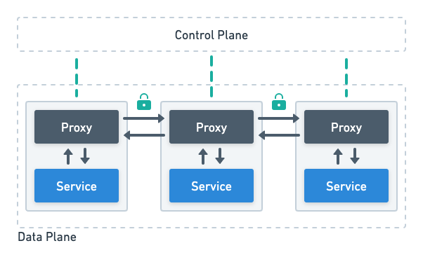

## Summary
Analysis on istio as a service mesh for inter-service communication.

## Analysis

### Service Mesh
Solution for managing communications between microservices.

#### Challenges in microservices
- **Handling Security**: Inter-service communcation is usually using HTTP or other insecure protocols and each service can talk to another in this setup
- **Resilience**: Resilience logic like retry or circuit breaker has to be implemented in each service
- **Metrics**: Traffic details metrics have to configured manually using tools like Prometheus

Here service mesh with sidecar proxies can help in tackling the challenges. It has 2 main components:

- **Sidecar Proxy**: Acts as a proxy to the application container and takes care of networking and can be configured by cluster networks easily.

- **Control Plane**: Takes care of installing the proxy as well as configuring them.

The network layer consisting of the control plane and the proxies is the **service-mesh**.

#### Istio
**Istio** is an implementation of the service-mesh where:
- Proxy - Envoy proxy
- Control Plane - Istiod

Components of istiod:
- Pilot: configuration and discovery
- Citadel: certificate management
- Galley: configuration management

##### Configuration Management

The service mesh has the following features:
- Traffic routing
- Service communication management
- Traffic splitting
- Retry Rules

For setting up the configuration for these features we have the following CRDs:
- **Virtual Service**: Responsible to route traffic **TO** a given destination
- **Destination Rule**: Responsible to decide what happens to the traffic **FOR** a given destination

The flow of the configuration works as follows:

**Here instead of configuring the individual proxies we configure Istiod and it propagates the configuration.**

Components involved:
- Galley reads the CRD configurations through the Kube API server APIs, validates it and forwards to the Pilot.
- Pilot takes the configurations and distributes it further to the Envoy proxies.

##### Service Discovery
Istiod maintains an internal service registry for service discovery. Using this service resitry the envoy proxies can send traffic to the relevant destination.

Components involved:
- Pilot is connected to the service registry (e.g., Kubernetes API) to keep track of services and endpoints.

##### Certificate Management
Secure TLS communication between the microservices with the help of mTLS setup.

##### Metrics and Tracing
Captures telemetry data from the envoy proxies.

##### Istio Ingress Gateway
Entrypoint to the cluster: alternative of the Ingress NGINX Controller.

#### Traffic Flow

## Installation in cluster
We have used the istio operator for installing the components in the cluster.
Here are the profiles in which the service-mesh can be installed.
- **Demo Profile**: This is a configuration with a good set of defaults that is optimized for developing and learning Istio. It's not suitable for production use. The demo profile includes a rich set of Istio features, such as tracing, metrics, and the dashboard.
  - **Supports**:
    - All core Istio features (traffic management, security, etc.)
    - Add-ons like Kiali, Jaeger, Grafana, Prometheus, and Zipkin for observability
    - Suitable for learning and experimenting with Istio
  - **Does Not Support**:
    - Production-grade security and performance settings
    - High-availability configurations
- **Default Profile**: This is the default configuration that comes with a balanced set of features, suitable for most use-cases. It's a good starting point for production deployments and can be further customized as needed.
  - **Supports**:
    - A balanced set of Istio features suitable for production use
    - Core components like Istiod, Ingress, and Egress gateways
  - **Does Not Support**:
    - Some of the add-ons included in the demo profile may not be enabled by default
- **Minimal Profile**: This configuration installs the bare minimum to get Istio up and running. It's useful for small-scale, resource-constrained environments, or when you only need the very basic functionality of Istio.
  - **Supports**:
    - The minimum necessary components for Istio to function (just Istiod)
    - Traffic management and security features at a basic level
  - **Does Not Support**:
    - Ingress and Egress gateways
    - Add-ons for observability

In our cluster, we installed the istio with `minimal` profile as  we only needed the istio-sidecar containers. These sidecar containers are necessary for estabilishing the peer-authentication between microservices as described [here](./documentation/peer-authentication.md).

## References
- Installing using helm: https://istio.io/latest/docs/setup/install/helm/
- Istio configuration profiles: https://istio.io/latest/docs/setup/additional-setup/config-profiles
- Sidecar Issues faced: 
  - https://github.com/istio/istio/issues/33911
  - https://stackoverflow.com/questions/54921054/terminate-istio-sidecar-istio-proxy-for-a-kubernetes-job-cronjob
- mTLS service-to-service secure communication blog: https://istio.io/latest/blog/2023/secure-apps-with-istio/
